.. |date| date:: %d/%m/%Y
.. |year| date:: %Y

.. footer::
   .. class:: tablefooter

   +-------------------------+-------------------------+
   | Stand: |date|           | .. class:: rightalign   |
   |                         |                         |
   |                         | ###Page###/###Total###  |
   +-------------------------+-------------------------+

.. header::
   .. image:: images/logo.png
      :width: 3.5cm
      :height: 1.225cm
      :align: right

.. sectnum::

============================================================
Extension zur Anbindung von Magento an den fraisr-Marktplatz
============================================================

.. raw:: pdf

   PageBreak

.. contents:: Inhaltsverzeichnis

.. raw:: pdf

   PageBreak

Voraussetzungen
===============

Um einen reibungslosen Ablauf der Extension zu gewährleisten, sind folgende Voraussetzungen zu erfüllen:

Magento
-------

Die Extension unterstützt folgende Magento-Versionen:

- Community-Edition 1.5+
- Community-Edition 1.6+
- Community-Edition 1.7+

Die Preise des Shops müssen in der Währung "Euro" angegeben sein.

Server
------

Die Anforderungen der Extension an den Server sind identisch zu den 
Magento-Server-Voraussetzungen (siehe http://www.magentocommerce.com/system-requirements).

Auszug:

- Linux x86, x86-64
- Apache 1.3.x, Apache 2.0.x, Apache 2.2.x
- PHP 5.2.13 - 5.3.24
- MySQL 4.1.20+
- Cronjobs (crontab)

fraisr
------

Um Artikel über die Magento-Extension bei fraisr einzustellen zu können, müssen Sie als gewerblicher
Händler registriert sein. Sofern Sie noch nicht registriert sind, melden Sie sich bitte auf folgender Seite an:
https://www.fraisr.com/register-business .

Folgende Zugangsdaten sind zur Konfiguration notwendig und im Nutzer-Dashboard von fraisr zu beantragen:

- Key
- Secret

Schritt für Schritt - Einrichtungsleitfaden
===========================================

Download der Extension
----------------------

#. Öffnen Sie die MagentoCommerce-Website (TODO: URL einfügen)
#. Akzeptieren Sie die allgemeinen Geschäftsbedingungen (AGB)
#. Kopieren Sie den Extension-Key in die Zwischenablage
#. Melden Sie sich in Ihrem Magento-Backend an
#. Navigieren Sie zu "System" -> "Magento Connect" -> "Magento Connect Manager"
#. Öffnen Sie das Tab "Extensions"
#. Kopieren Sie den Extension-Key aus der Zwischenablage in das Eingabefeld "Paste extension key to install" und wählen Sie anschließend "Install" und im Fall einer Bestätigungs-Aufforderung "Proceed"
#. Sofern im schwarzen Terminal die Nachricht "Package ... installed successfully" erscheint, wurde die Extension korrekt installiert.

Konfiguration
-------------

Um zum fraisr-Konfigurationsbereich im Magento-Backend zu gelangen, navigieren Sie zu:
"System" -> "Konfiguration" -> "SERVICES" -> "fraisr".

Basiskonfiguration
~~~~~~~~~~~~~~~~~~

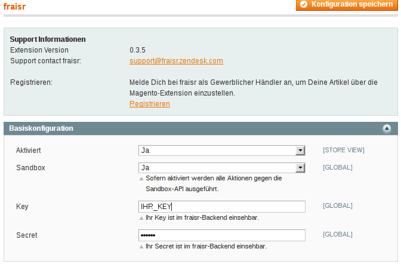

   Basiskonfiguration

.. raw:: pdf

   PageBreak

.. list-table:: Basiskonfiguration
   :widths: 15 40
   :header-rows: 1

   * - Konfiguration

     - Beschreibung

   * - Aktiviert

     - Hier können Sie auswählen, ob die fraisr-Extension aktiv oder inaktiv ist. Sofern hier "Nein" ausgewählt wird, finden keine 
       Synchronisierungen per Cronjob und Anpassungen im Frontend statt. Nach der Installation ist die Extension standardmäßig deaktiviert.

   * - Sandbox

     - Sofern aktiviert, werden alle Aktionen gegen die Sandbox-API ausgeführt. Damit lässt sich die Integration und Funktionalität der Extension im Shop überprüfen. Die Zugangsdaten zur Sandbox sind nicht identisch mit denen der Live-Umgebung.  

       | Die Zugansdaten für die Testumgebung sind:  
       | 
       | Key: **key**
       | Secret: **secret**  
       | 
       | Mit der Sandbox Site können Sie überprüfen, wie Ihre Produkte in unserem Marktplatz angezeigt werden und ob die Synchronisierung grundsätzlich funktioniert.  
       | 
       | Ihre Artikel landen in unserem Testsystem und können noch nicht gekauft werden.
       |
       | http://fraisr-test.herokuapp.com

   * - Key

     - Ihr Key ist im fraisr-Backend einsehbar.

   * - Secret

     - Ihr Secret ist im fraisr-Backend einsehbar.

Produkt-Synchronisierung
~~~~~~~~~~~~~~~~~~~~~~~~

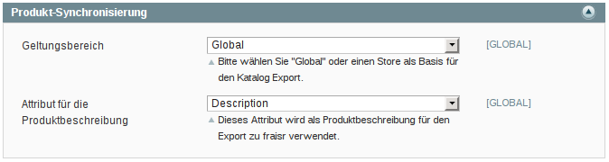

   Produkt-Synchronisierung

.. list-table:: Produkt-Synchronisierung
   :widths: 15 40
   :header-rows: 1

   * - Konfiguration

     - Beschreibung

   * - Geltungsbereich

     - Der hier festgelegte Geltungsbereich wird als Basis für den Produktexport verwendet. In einer Multistore-Umgebung mit mehreren Sprachen sollten Sie den
       Geltungsbereich (Scope) festlegen, indem die Produkt-Attribute in deutscher Sprache verfügbar sind.

   * - Attribut für die Produktbeschreibung

     - Dieses Attribut wird als Produktbeschreibung für den Export zu fraisr verwendet. HTML-Quellcode wird bei der Synchronisation an fraisr entfernt.

.. raw:: pdf

   PageBreak

Bestellungs-Synchronisierung
~~~~~~~~~~~~~~~~~~~~~~~~~~~~

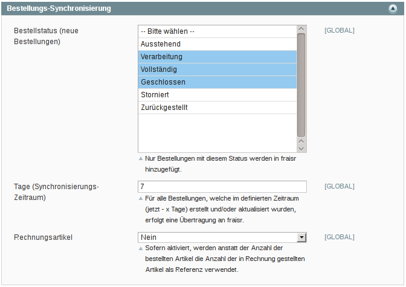

   Spendenlabel Bestellungs-Synchronisierung

.. list-table:: Bestellungs-Synchronisierung
   :widths: 15 40
   :header-rows: 1

   * - Konfiguration

     - Beschreibung

   * - Bestellstatus (neue Bestellungen)

     - Nur Bestellungen mit diesem Bestellstatus werden als "neu" erkannt und an fraisr übertragen. Auf eine Zahlung wartende Bestellungen können so von der Synchronisierung ausgeschlossen werden. Für die Aktualisierung und Stornierung (Löschung) von Bestellungen ist diese Einstellung nicht mehr relevant.

   * - Tage (Synchronisierungs - Zeitraum)

     - Hier kann festgelegt werden, in welchem Zeitraum die Extension nach zu synchronisierenden Bestellungen filtern soll. In der Standardeinstellung "7" wird für die letzten 7 Tage nach zu synchronisierenden Bestellungen gesucht. Als Referenz gilt das Erstellungs- bzw. Aktualisierungsdatum der Bestellungen. Dieser Zeitraum ist ausreichend, sofern die Bestellungs-Synchronisierung mindestens einmal täglich (z.B. durch den Cronjob) durchgeführt wird.

   * - Rechnungsartikel

     - Sofern aktiviert, werden anstatt der Anzahl der bestellten Artikel die Anzahl der in Rechnung gestellten Artikel als Referenz verwendet. Dies ist für Shops relevant, bei denen nur im Shop in Rechnung gestellte Artikel als wirklich verkaufte Artikel gelten.

.. raw:: pdf

   PageBreak

Spendenlabel Produktübersicht
~~~~~~~~~~~~~~~~~~~~~~~~~~~~~

.. figure:: images/screenshots/configarea_frontend.png
   :width: 12cm

   Spendenlabel Produktübersicht

.. list-table:: Spendenlabel Produktübersicht
   :widths: 15 40
   :header-rows: 1

   * - Konfiguration

     - Beschreibung

   * - Spendenkennzeichnung

     - Diese Einstellung legt fest, ob die Spendenkennzeichnung im Frontend in der Produktliste als Icon oder als Banderole erfolgen soll.

   * - Icon-Position

     - Diese Konfiguration gibt die Position des Icons im Frontend an und wird verwendet wenn "Spendenkennzeichnung" auf "Icon" eingestellt ist.

   * - Banderole-Position

     - Diese Konfiguration gibt die Position der Banderole im Frontend an und wird verwendet wenn "Spendenkennzeichnung" auf "Banderole" eingestellt ist.

   Produkt mit Spendenkennzeichnung "Banderole" im Frontend

   Produkt mit Spendenkennzeichnung "Icon" im Frontend

Spendenlabel Produktdetailansicht
~~~~~~~~~~~~~~~~~~~~~~~~~~~~~~~~~

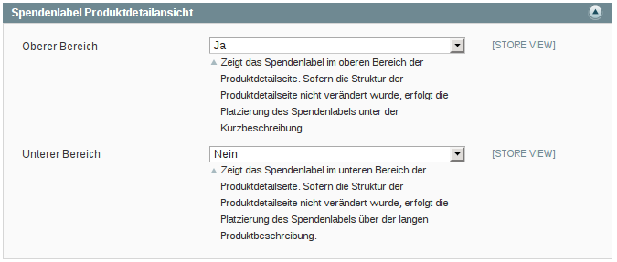

   Spendenlabel Produktdetailansicht

.. list-table:: Spendenlabel Produktübersicht
   :widths: 15 40
   :header-rows: 1

   * - Konfiguration

     - Beschreibung

   * - Oberer Bereich

     - Sofern aktiviert, wird das Spendenlabel im oberen Bereich der Produktdetailseite gezeigt. Vorausgesetzt die Struktur der Produktdetailseite wurde nicht verändert, erfolgt die Platzierung des Spendenlabels unter der Kurzbeschreibung.

   * - Unterer Bereich

     - Sofern aktiviert, wird das Spendenlabel im unteren Bereich der Produktdetailseite gezeigt. Vorausgesetzt die Struktur der Produktdetailseite wurde nicht verändert, erfolgt die Platzierung des Spendenlabels über der langen Produktbeschreibung.

fraisr-Protokoll
----------------

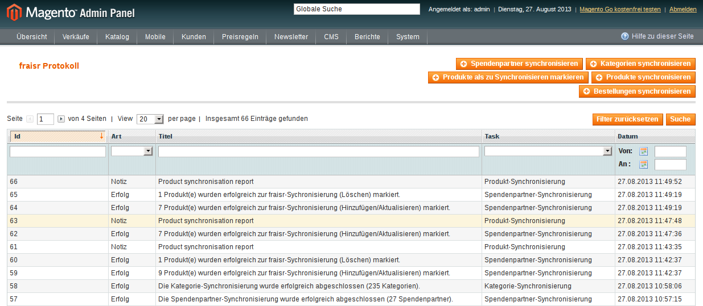

   fraisr Protokoll / Log

Unter System -> "fraisr Protokoll" finden Sie alle Buttons um die Prozesse der Synchronisierung auch manuell auszulösen:

#. Spendenpartner synchronisieren
#. Kategorien synchronisieren
#. Produkte als zu Synchronisieren markieren
#. Produkte synchronisieren
#. Bestellungen synchronisieren

Dies empfiehlt sich im Besonderen bei der Inbetriebnahme oder bei Fehlern im Synchronisationsprozess.

Zusätzlich finden Sie in der Liste ein Protokoll aller Synchronisierungs-Prozesse, unabhängig davon ob diese manuell oder automatisch
ausgeführt wurden. Bei Fehlern können Sie beim Klick auf eine Meldung ggf. genauere Details erhalten.

Synchronisation der Spendenpartner und Kategorien
-------------------------------------------------

Nach der Installation und Konfiguration der Extension erscheint beim Bearbeiten eines Produkts im Backend der Hinweis,
dass eine Synchronisierung der fraisr-Spendenpartner und fraisr-Kategorien notwendig ist.

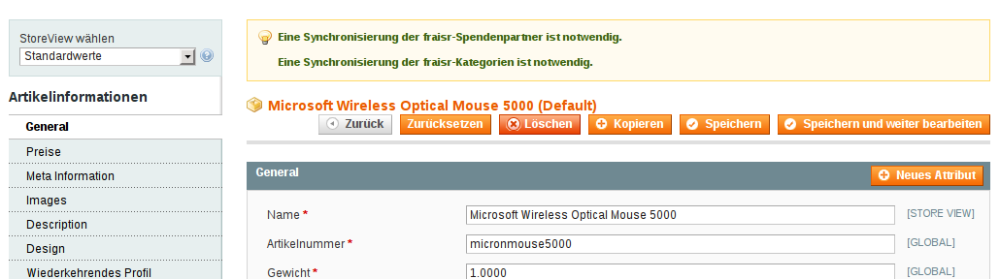

   Notiz: Synchronisation der Spendenpartner und Kategorien notwendig

Nach der Durchführung beider Synchronisierungen können die importieren Werte der Felder "fraisr Spendenpartner" und
"fraisr Spendenanteil" in der Produktverwaltung ausgewählt werden.

.. raw:: pdf

   PageBreak

Spendenpartner
~~~~~~~~~~~~~~

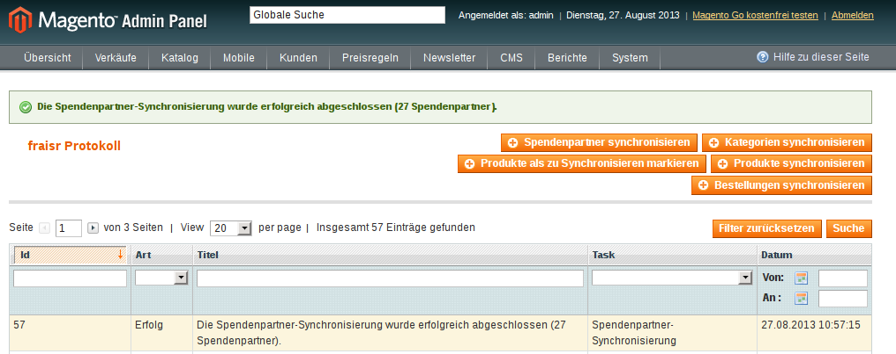

   Erfolgreiche Spendenpartner-Synchronisierung

Die Synchronisierung der fraisr-Spendenpartner kann im Magento-Backend unter "System" -> "fraisr Protokoll" -> "Spendenpartner synchronisieren" 
gestartet werden. Im Erfolgsfall erscheint die Meldung "Die Spendenpartner-Synchronisierung wurde erfolgreich abgeschlossen (xx Spendenpartner).".

Eine automatische Synchronisierung der fraisr-Spendenpartner erfolgt täglich nachts per Cronjob um 01:30Uhr Shop-Zeit.

Sollte bei späteren Synchronisierungen ein Spendenpartner nicht mehr zur Verfügung stehen, wird ein Produkt im Shop, welches diesen Spendenpartner
ausgewählt hat automatisch mittels "fraisr aktiv":"Nein" bei fraisr deaktiviert.

Kategorien
~~~~~~~~~~

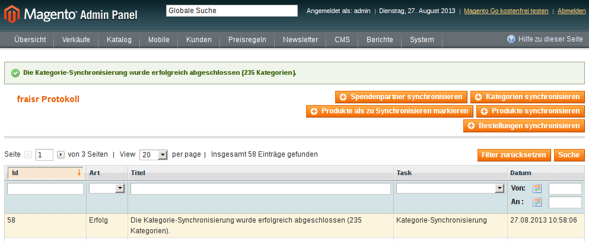

   Erfolgreiche Kategorie-Synchronisierung

Die Synchronisierung der fraisr-Kategorien kann im Magento-Backend unter "System" -> "fraisr Protokoll" -> "Kategorien synchronisieren" 
gestartet werden. Im Erfolgsfall erscheint die Meldung "Die Kategorie-Synchronisierung wurde erfolgreich abgeschlossen (xxx Kategorien).".

Eine automatische Synchronisierung der fraisr-Kategorien erfolgt täglich nachts per Cronjob um 02:00Uhr Shop-Zeit.

.. raw:: pdf

   PageBreak

Labeln eines Produktes im Shop
------------------------------

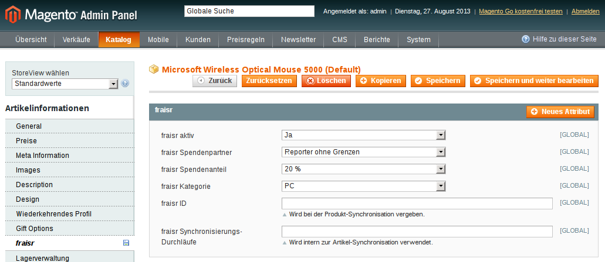

   Festlegung der fraisr-Attributwerte am Produkt

Um ein Produkt im nächsten Schritt "Produkt-Synchronisation" an fraisr übertragen zu können, muss dieses zuerst im Shop angelegt werden
(selbstverständlich können Sie auch bereits vorhandene Produkte für fraisr labeln).
Anschließend können beim Editieren eines Produktes im Tab "fraisr" folgende Werte festgelegt werde n:

.. list-table:: fraisr Produkt-Attribute - editierbar
   :widths: 15 40
   :header-rows: 1

   * - Feld

     - Beschreibung

   * - fraisr aktiv

     - Diese Einstellung legt fest, ob das Produkt an fraisr übertragen werden soll und ob eine Kennzeichnung des Produktes im Shop-Frontend als "fraisr"-Produkt per Icon oder Banderole erfolgt.

   * - fraisr Spendenpartner

     - Der bei einem Verkauf des Produktes unterstützte Spendenpartner.

   * - fraisr Spendenanteil

     - Der bei einem Verkauf des Produktes anzusetzende Spendenanteil in Prozent.

   * - fraisr Kategorie

     - Die Kategorie, in der das Produkt nach der Übertragung an fraisr auf dem Marktplatz fraisr.com eingestellt wird.

Die folgenden Werte werden von der Extension vergeben und können nicht vom Shopbetreiber festgelegt werden:

.. list-table:: fraisr Produkt-Attribute - nicht editierbar
   :widths: 15 40
   :header-rows: 1

   * - Feld

     - Beschreibung

   * - fraisr ID

     - Die fraisr ID wird nach der Synchronisation des Produktes durch fraisr vergeben und in diesem Attribut gespeichert.

   * - fraisr Synchronisierungs - Durchläufe

     - Dieses Attribut wird intern zur Produkt-Synchronisation verwendet. Im Fall, dass es bei der Synchronisierung zu einem Verbindungsfehler kommt,
       wird versucht das Produkt max. 3 mal zu übertragen bevor kein erneuter Übertragungsversuch erfolgt.

Gegenwärtig werden folgende Produkt-Typen unterstützt:

- einfache Produkte (Simple Products)
- virtuelle Produkte (Virtual Products)
- Download-Produkte (Downloadable Products)
- konfigurierbare Produkte (Configurable Products)
- gebündelte Produkte (Bundle Products)

Gruppierte Produkte werden nicht unterstützt.

Produkt-Synchronisation
-----------------------

Das Verfahren zur Produkt-Synchronisation läuft in zwei Schritten ab:

#. Markierung der Produkte
#. Synchronisation der markierten Produkte

Die Aufteilung in zwei Schritte ist notwendig, damit im Fall von Übertragungsfehlern oder Limits in der Script-Laufzeit
nicht alle Produkte erneut synchronisiert werden müssen.

Markierung der Produkte
~~~~~~~~~~~~~~~~~~~~~~~

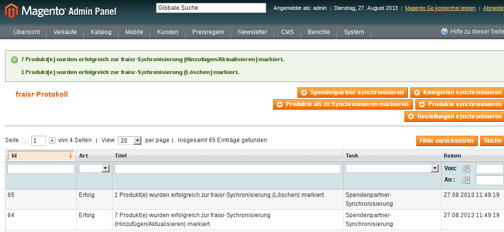

   Markierung der Produkte zur Synchronisierung

Per System -> fraisr Protokoll -> "Produkte als zu Synchronisieren markieren" werden die Produkte manuell als zu Synchronisieren markiert.

Folgende Konstellationen werden dabei beachtet:

.. list-table:: Markierung der Produkte - Konstellationen
   :widths: 15 40
   :header-rows: 1

   * - Konstellation 

     - Beschreibung

   * - Neue Produkte

     - Als neu hinzuzufügende Produkte gelten alle Produkte, bei denen "fraisr aktiv":"Ja" eingestellt ist und die noch keine
       fraisr ID besitzen.

   * - Zu aktualisierende Produkte

     - Als zu aktualisierende Produkte gelten alle Produkte, bei denen "fraisr aktiv":"Ja" eingestellt ist und die bereits eine
       fraisr ID besitzen.

   * - Zu löschende Produkte

     - Es gibt zwei Wege, wie ein Produkt für fraisr als zu löschend markiert werden kann. Zum einen gilt ein Produkt als zu löschen, 
       wenn "fraisr aktiv" auf "Nein" eingestellt ist und das Produkt bereits eine fraisr ID besitzt. Zum anderen wird im Fall, dass ein Produkt im Shop
       gelöscht wird, welches eine fraisr ID besitzt, in einer Lösch-Queue (Warteschleife) gespeichert.

Die Markierung ob zu Synchronisieren ist, geschieht im Produktattribut "fraisr_update" bzw. "fraisr Synchronisierungs-Durchläufe".

Die Markierung der Produkte findet automatisch jede Nacht (per Cronjob) um 02:30Uhr Shop-Zeit statt.

Synchronisation der markierten Produkte
~~~~~~~~~~~~~~~~~~~~~~~~~~~~~~~~~~~~~~~

Per System -> fraisr Protokoll -> "Produkte synchronisieren" kann die Synchronisation der markierten Produkte manuell gestartet werden.

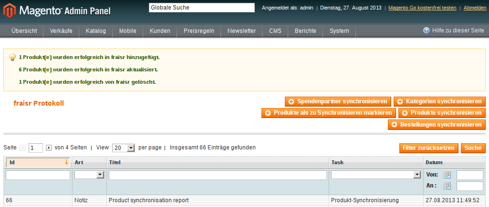

   Synchronisation der Produkte

Bei der Synchronisierung werden die Produktdaten für die Übermittlung an fraisr vorbereitet und anschließend übertragen. Dabei handelt es sich um die 
Werte:

- Artikelnummer (SKU)
- Name
- Beschreibung
- Preis
- Sonderpreis
- URL
- Bilder
- Lagermenge
- fraisr Kategorie
- fraisr Spendenpartner
- fraisr Spendenanteil

Sollte die Lagermenge unter 1 betragen oder wie bei konfigurierbaren und gebündelten Artikel nicht für das Hauptprodukt zu ermitteln sein,
wird generell 1 übertragen.

Um eine ungewollte Unterbrechung der Synchronisierung zu vermeiden, gibt es in der Extension eine
permanente Prüfung auf die maximale Script-Laufzeit. Zehn Sekunden bevor diese abläuft, wird die Synchronisierung gestoppt.
Im Fall dass die Synchronisierung manuell im Backend angestoßen wurde, wird eine Nachricht ausgegeben, dass die Aktion noch einmal angestoßen
werden muss. Im Fall dass die Synchronisierung per Cronjob ausgeführt wurde, wird dynamisch ein erneuter Cronjob erstellt, 
der die Synchronisierung 15 Minuten nach der aktuellen Ausführungszeit fortsetzt.

Der Crojobs zum Synchronisieren der Produkte läuft täglich 3:00Uhr nachts (Shop-Zeit).

Unter System -> fraisr Protokoll wird nach jedem Durchlauf ein Report über die Synchronisierung und eventuelle Fehler abgelegt.
Dort ist gegebenenfalls ersichtlich, wieso einzelne Produkte nicht synchronisiert werden konnten.

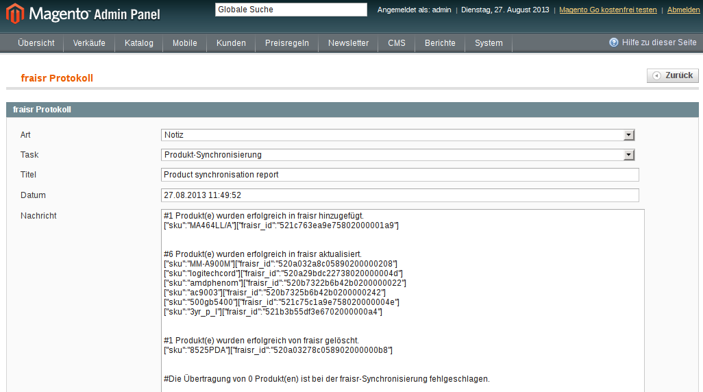

   Produkt-Synchronisation Report

Synchronisation der Bestellungen
--------------------------------

Per System -> fraisr Protokoll -> "Bestellungen synchronisieren" werden die Bestellungen manuell synchronisiert.
Dieser Prozess wird ebenfalls täglich nachts um 04:00Uhr Shop-Zeit automatisch per Cronjob durchgeführt.

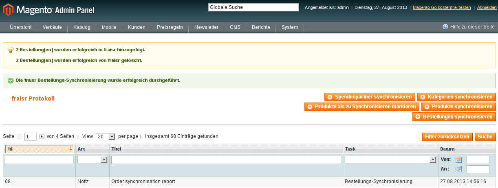

   Synchronisation der Bestellungen

Die Extension prüft an Hand der Konfigurationseinstellungen (Bestellstatus, Tage) ob Bestellungen zu synchronisieren sind.
Wichtig: Jeder Artikel einer Bestellung wird, sofern es sich um einen fraisr-Artikel handelt, einzeln an fraisr übertragen und 
erhält in­fol­ge­des­sen eine eigene fraisr-Bestellnummer.

Beispiel: Bestellung #100000123

- Produkt A, Menge 1, fraisr ID: 1234
- Produkt B, Menge 1, fraisr ID: nicht vorhanden
- Produkt C, Menge 2, fraisr ID: 5678

Synchronisation an fraisr:

- Produkt A wird mit der Menge 1 an fraisr übertragen und erhalt eine eigene fraisr-Bestellnummer
- Produkt B wird nicht an fraisr übertragen, da es kein aktives fraisr-Produkt ist
- Produkt C wird mit der Menge 2 an fraisr übertragen und erhalt eine eigene fraisr-Bestellnummer

Bei der Übertragung an fraisr werden folgende Daten gesendet:

- fraisr ID des Produktes
- Menge
- Preis
- Spendenpartner
- Spendenanteil

Die zur Übertragung verwendeten Daten werden zum Zeitpunkt der Bestellung am Artikel gespeichert und sind unabhängig von späteren
Anpassungen am Magento-Produkt.

Um analog zur Produkt-Synchronisierung eine ungewollte Unterbrechung zu vermeiden, gibt es in der Extension eine
permanente Prüfung auf die maximale Script-Laufzeit. Zehn Sekunden bevor diese abläuft, wird die Synchronisierung gestoppt.
Im Fall dass die Synchronisierung manuell im Backend angestoßen wurde, wird eine Nachricht ausgegeben, dass die Aktion noch einmal angestoßen
werden muss. Im Fall dass die Synchronisierung per Cronjob ausgeführt wurde, wird dynamisch ein erneuter Cronjob erstellt, 
der die Synchronisierung 15 Minuten nach der aktuellen Ausführungszeit fortsetzt.

.. raw:: pdf

   PageBreak

Shop Frontend
-------------

Die Extension beeinflusst die Darstellung der Produkte in der Kategorieansicht/Produktliste, den Suchergebnis-Seiten und der Produktdetailseite.

Kategorieansicht/Produktliste und Suchergebnis-Seiten
~~~~~~~~~~~~~~~~~~~~~~~~~~~~~~~~~~~~~~~~~~~~~~~~~~~~~

   Produktliste im Frontend - Icon oben links

   Produktliste im Frontend - Banderole unten

Für die an fraisr übermittelten Artikel (fraisr ID vorhanden) in der Kategorieansicht/Produktliste und den Suchergebnis-Seiten
wird je nach Konfiguration ein Icon oder eine Banderole angezeigt. Die Position der Icons oder Banderolen kann im Konfigurationsbereich
festgelegt werden.

Die Daten zur Erstellung der Banderolen (Spendenpartner und Spendenanteil) werden mittels JSON im Quelltext hinzugefügt. Die Darstellung und 
Positionierung der Icons und Banderolen erfolgt durch eine fraisr.js- und fraisr.css - Datei, welche extern vom fraisr-Server eingebunden werden.

Produktdetailansicht
~~~~~~~~~~~~~~~~~~~~

In der Produktdetailansicht erfolgt die Darstellung der Spendenlabel an zwei möglichen Orten:

#. im oberen Bereich der Produktdetailseite unter der Kurzbeschreibung
#. im unteren Bereich der Produktdetailseite über der langen Produktbeschreibung

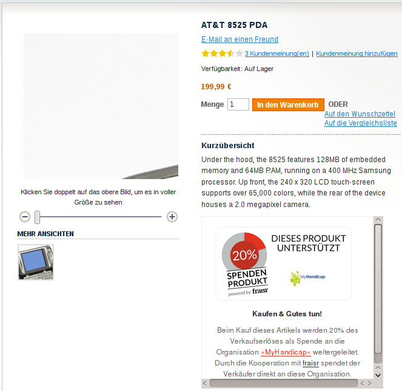

   Produktdetailseite - Spendenlabel oben

Die Position kann im Konfigurationsbereich "Spendenlabel Produktdetailansicht" festgelegt werden.

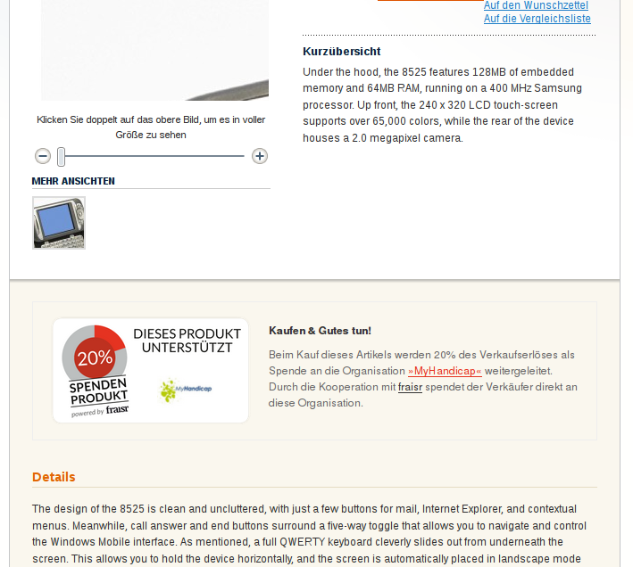

   Produktdetailseite - Spendenlabel unten

Die Spendenlabel sind mittels Iframes eingebunden, welche direkt von fraisr geladen werden. Die vertikale Höhen-Festlegung
des Iframes erfolgt durch eine fraisr.js- und fraisr.css - Datei, welche extern vom fraisr-Server eingebunden wird.

Spendenprodukt - Provision & Abbuchung per Rechnung
---------------------------------------------------

Beim Verkauf eines Spendenprodukts über die fraisr-Extension in Ihrem Magento-Shop wird 28 Tage später und dann jeweils Mitte bzw. Ende des Monats die Abrechnung erstellt.

Wir gehen davon aus, dass bis dahin alle möglichen Rücksendungen und Reklamationen abgeschlossen sind. 

fraisr stellt Ihnen die ausgehandelte Provision sowie den Spendenanteil in Rechnung. Der Spendenanteil wird an die Spendenorganisation weitergereicht.

Troubleshooting
===============

Cronjob-Konfiguration
---------------------

Auf folgenden Seiten finden Sie Informationen zur Einrichtung des Magento-Cronjobs:

- http://www.webguys.de/magento/adventskalender/turchen-15-cronjobs-im-magento/
- http://neoshops.de/2013/02/13/magento-doithisself-cronjobs-einrichten-und-laufen-lassen/
- http://kkoepke.de/magentoecommerce/magento-cronjobs/
- http://www.magentocommerce.com/wiki/\1_-_installation_and_configuration/how_to_setup_a_cron_job

Frontend - Anpassungen
----------------------

Im Fall, dass es bei der Positionierung und Anzeige der Icons und Banderolen in der Kategorieansicht/Produktliste und den Suchergebnis-Seiten
zu Problemen kommt, wenden Sie sich bitte an den fraisr-Support.

Im Folgenden wird die Implementierung im Magento-Shop beschrieben, sodass Probleme durch Anpassungen in der Struktur der 
Produktliste und Produktdetailansicht behoben werden können.

Die Layout-XML-Datei:

 app/design/frontend/base/default/layout/fraisrconnect.xml

steuert die Einbindung folgender Content-Block-Elemente:

- Widget zur Integration der externen Dateien fraisr.js und fraisr.css
- Spendenlabel oben/unten in der Produktdetailansicht
- JSON-Daten in der Kategorieansicht/Produktliste und den Suchergebnis-Seiten
- JSON-Daten in der Produktdetailansicht

Widget zur Integration der externen Dateien fraisr.js und fraisr.css
~~~~~~~~~~~~~~~~~~~~~~~~~~~~~~~~~~~~~~~~~~~~~~~~~~~~~~~~~~~~~~~~~~~~

Die Einbindung erfolgt mittels des Blocks "fraisrconnect_frontend_widget" im Bereich "before_body_end".

.. code:: xml

 <block
     type="fraisrconnect/frontend_widget"
     name="fraisrconnect_frontend_widget">
     <action ifconfig="fraisrconnect/general/active" method="setTemplate">
         <template>fraisrconnect/frontend/widget.phtml</template>
     </action>
 </block>

Im Fall von Problemen prüfen Sie bitte, ob der Bereich "before_body_end" im übergeordneten Template korrekt zur Verfügung steht.

Spendenlabel oben/unten in der Produktdetailansicht
~~~~~~~~~~~~~~~~~~~~~~~~~~~~~~~~~~~~~~~~~~~~~~~~~~~

Die Einbindung des oberen Blocks "fraisrconnect_catalog_product_view_label_top" erfolgt im Bereich "other".

.. code:: xml

  <block
      type="fraisrconnect/catalog_product_view_label"
      name="fraisrconnect_catalog_product_view_label_top"
      as="other">
      <action
          ifconfig="fraisrconnect/frontend_detailpage/area_top"
          method="setTemplate">
          <template>fraisrconnect/catalog/product/view/label_top.phtml</template>
      </action>
  </block>

Für den Fall, dass das Spendenlabel nicht angezeigt wird, prüfen Sie bitte, ob im view.phtml - Template der
Produktdetailseite der Getter für den "other"-Bereich zur Verfügung steht bzw. kein anderes Modul diesen 
Bereich verwendet.

.. code:: html

 <?php echo $this->getChildHtml('other');?>

Die Einbindung des unteren Blocks "fraisrconnect_catalog_product_view_label_bottom" erfolgt im Bereich "detailed_info".

.. code:: xml

  <block
      type="fraisrconnect/catalog_product_view_label"
      name="fraisrconnect_catalog_product_view_label_bottom"
      as="fraisrconnect-catalog-product-view-label-bottom"
      before="-">
      <action
          method="addToParentGroup"
          ifconfig="fraisrconnect/frontend_detailpage/area_bottom">
          <group>detailed_info</group>
      </action>
      <action
          method="setTemplate"
          ifconfig="fraisrconnect/frontend_detailpage/area_bottom">
          <template>fraisrconnect/catalog/product/view/label_bottom.phtml</template>
      </action>
  </block>

Sofern das Spendenlabel unten nicht angezeigt wird, prüfen Sie, ob der folgende Quellcode korrekt im view.phtml - Template
der Produktdetailseite eingebunden ist.

.. code:: html

 <?php foreach ($this->getChildGroup('detailed_info', 'getChildHtml') as $alias => $html):?>
    
">
        <?php if ($title = $this->getChildData($alias, 'title')):?>
        <h2><?php echo $this->escapeHtml($title); ?></h2>
        <?php endif;?>
        <?php echo $html; ?>
    

 <?php endforeach;?>

JSON-Daten in der Kategorieansicht/Produktliste und den Suchergebnis-Seite
~~~~~~~~~~~~~~~~~~~~~~~~~~~~~~~~~~~~~~~~~~~~~~~~~~~~~~~~~~~~~~~~~~~~~~~~~~

Die Einbindung erfolgt mittels des Blocks "fraisrconnect_catalog_product_json_list" im Bereich "before_body_end".

.. code:: xml

  <block
      type="fraisrconnect/catalog_product_json_list"
      name="fraisrconnect_catalog_product_json_list">
      <action ifconfig="fraisrconnect/general/active" method="setTemplate">
          <template>fraisrconnect/catalog/product/json/list.phtml</template>
      </action>
  </block>

Im Fall von Problemen prüfen Sie bitte, ob der Bereich "before_body_end" im übergeordneten Template korrekt zur Verfügung steht.

JSON-Daten in der Produktdetailansicht
~~~~~~~~~~~~~~~~~~~~~~~~~~~~~~~~~~~~~~

Die Einbindung erfolgt mittels des Blocks "fraisrconnect_catalog_product_json_view" im Bereich "before_body_end".

.. code:: xml

  <block
      type="fraisrconnect/catalog_product_json_view"
      name="fraisrconnect_catalog_product_json_view">
      <action
          ifconfig="fraisrconnect/general/active"
          method="setTemplate">
          <template>fraisrconnect/catalog/product/json/view.phtml</template>
      </action>
  </block>

Im Fall von Problemen prüfen Sie bitte, ob der Bereich "before_body_end" im übergeordneten Template korrekt zur Verfügung steht.